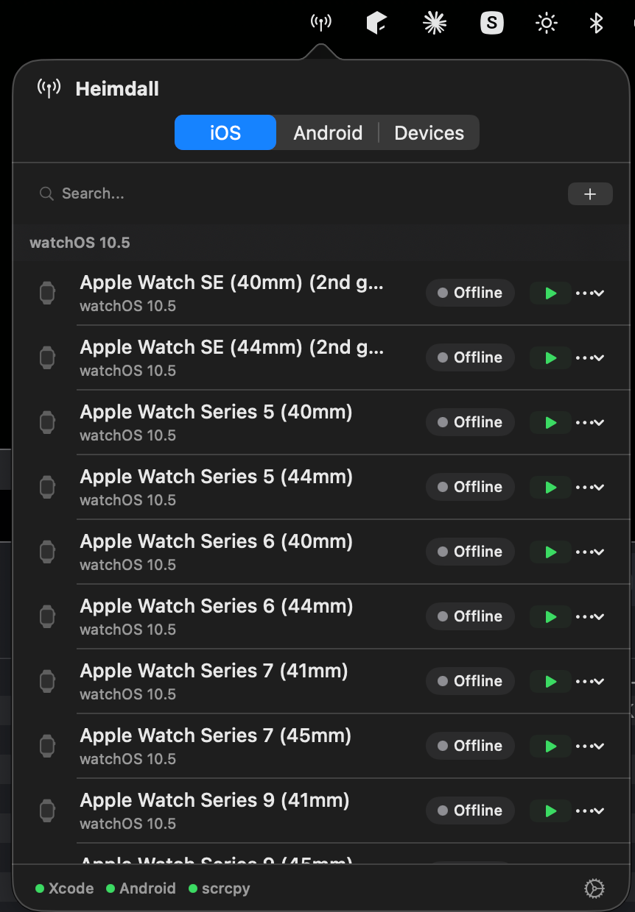
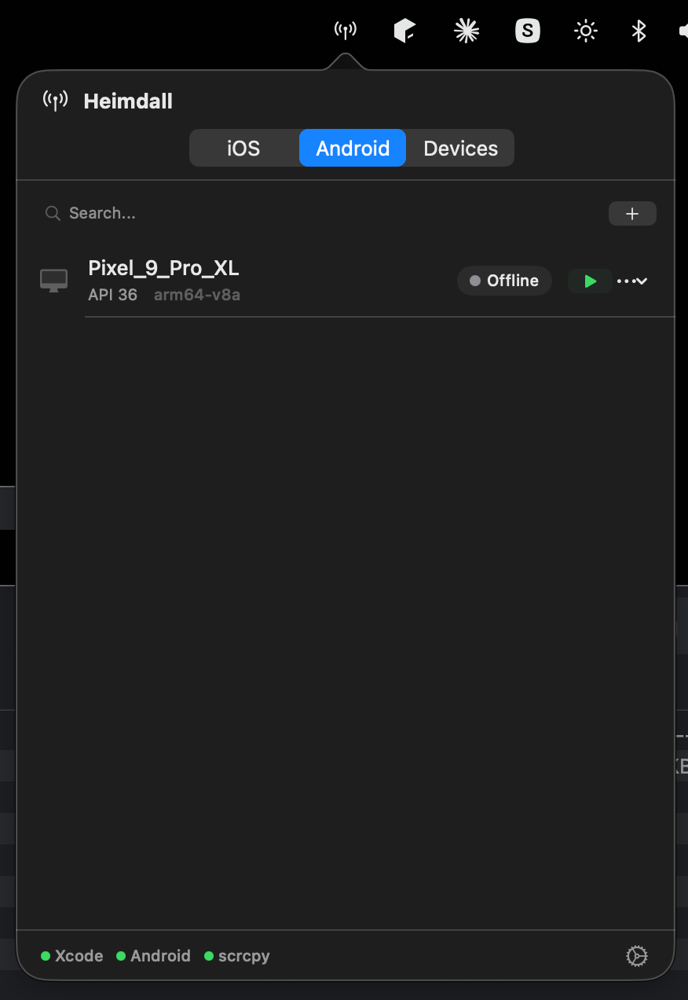
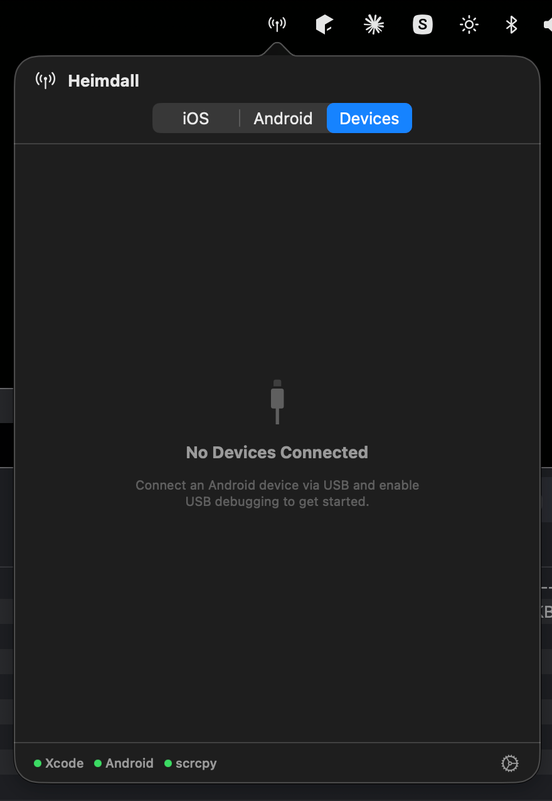

# Heimdall

A lightweight macOS menu bar app for managing iOS Simulators, Android Emulators, and mirroring physical Android devices — all from one place.

Built with Swift + SwiftUI. Lives in your menu bar with a clean popover UI, no dock icon clutter.

## Features

**iOS Simulators**
- List all available simulators grouped by runtime (iOS, watchOS, tvOS)
- Boot, shutdown, erase, and delete simulators
- Create new simulators from installed runtimes and device types
- Real-time status updates with polling

**Android Emulators**
- List all AVDs with running status detection
- Start, stop, and delete emulators
- Create new emulators from installed system images
- Advanced configuration: RAM, internal storage, GPU acceleration (hardware/software/auto)
- Auto-detects Android SDK path with manual fallback

**Device Mirroring**
- Lists connected Android devices via adb
- One-click screen mirroring via scrcpy
- Real-time USB device monitoring (instant attach/detach detection via `adb track-devices`)
- Shows device authorization status

**General**
- Menu bar app with NSPopover (like JetBrains Toolbox)
- No dock icon (`LSUIElement`)
- Auto-detects Xcode, Android SDK, and scrcpy paths
- Manual path configuration in Settings
- Environment status indicators in the footer

## Screenshots

| iOS Simulators | Android Emulators | Device Mirroring |
|:-:|:-:|:-:|
|  |  |  |

## Requirements

- macOS 14.0 (Sonoma) or later
- Xcode (for iOS Simulator management)
- Android SDK (for emulator management)
- [scrcpy](https://github.com/Genymobile/scrcpy) (for device mirroring, optional)

## Setup

1. Clone the repo and open `Heimdall.xcodeproj` in Xcode
2. Build and run (⌘R)
3. Heimdall appears in the menu bar with an antenna icon
4. The app auto-detects tool paths on first launch — configure manually in Settings if needed

### Installing scrcpy

```bash
brew install scrcpy
```

## Architecture

```
Heimdall/
├── HeimdallApp.swift          # @main entry point
├── AppDelegate.swift           # NSStatusBar + NSPopover setup
├── Models/
│   ├── DeviceStatus.swift      # Shared status enum
│   ├── iOSSimulator.swift      # Simulator + Codable JSON models
│   ├── AndroidEmulator.swift   # AVD + SystemImage + EmulatorConfig
│   └── AndroidDevice.swift     # Physical device + mirroring session
├── Services/
│   ├── ShellCommandRunner.swift # Process execution with pipe deadlock fix
│   ├── EnvironmentService.swift # Tool path detection
│   ├── SimctlService.swift      # xcrun simctl wrapper
│   ├── AVDService.swift         # avdmanager/emulator wrapper
│   ├── ADBService.swift         # adb wrapper
│   ├── ScrcpyService.swift      # scrcpy process management
│   └── USBDeviceMonitor.swift   # Real-time device monitoring
├── ViewModels/
│   ├── iOSSimulatorsViewModel.swift
│   ├── AndroidEmulatorsViewModel.swift
│   ├── DeviceMirroringViewModel.swift
│   └── SettingsViewModel.swift
└── Views/
    ├── MainPopoverView.swift    # Root tabbed container
    ├── iOS/                     # Simulator tab views
    ├── Android/                 # Emulator tab views
    ├── Devices/                 # Device mirroring views
    ├── Settings/                # Settings sheet
    └── Shared/                  # Reusable components
```

## Tech Notes

- Uses `@Observable` macro (requires macOS 14+)
- Actor-based service layer for thread-safe CLI execution
- Direct `simctl` binary execution (bypasses `xcrun` shell issues in GUI apps)
- Concurrent pipe reading to prevent buffer deadlocks with large CLI outputs
- `adb track-devices` for real-time USB monitoring with polling fallback
- App Sandbox disabled via entitlements for Process execution

## License

MIT
